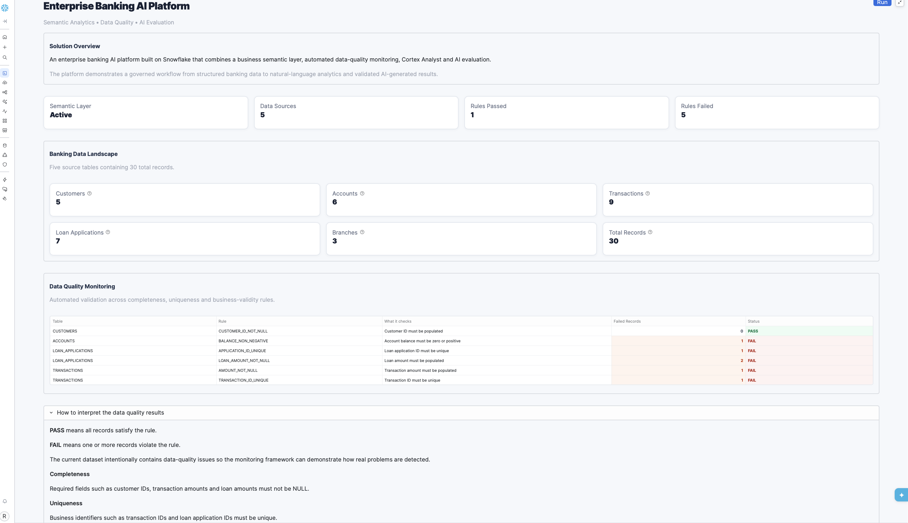
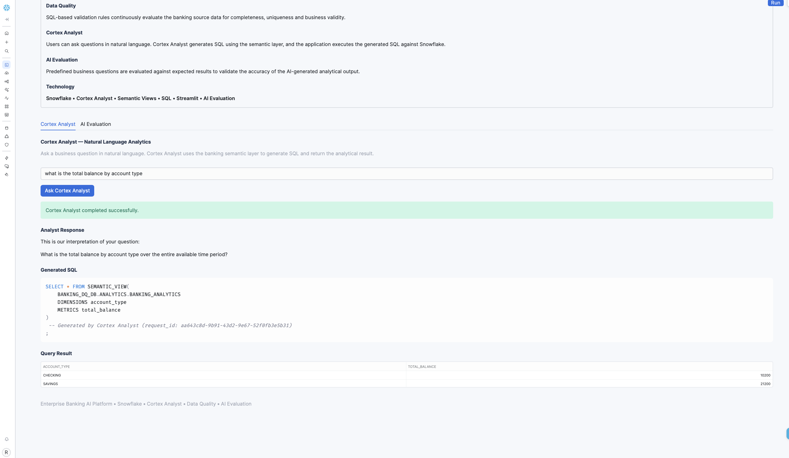
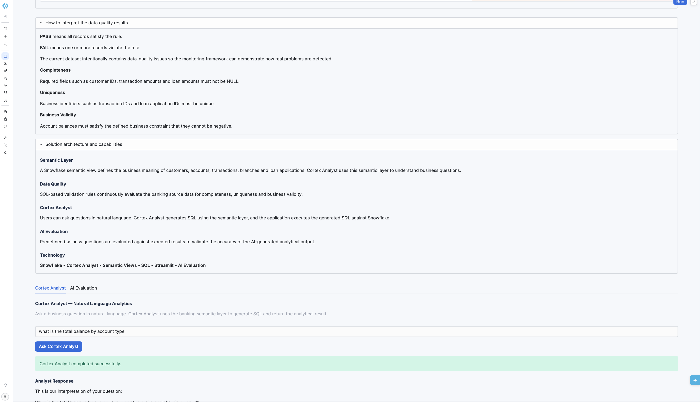
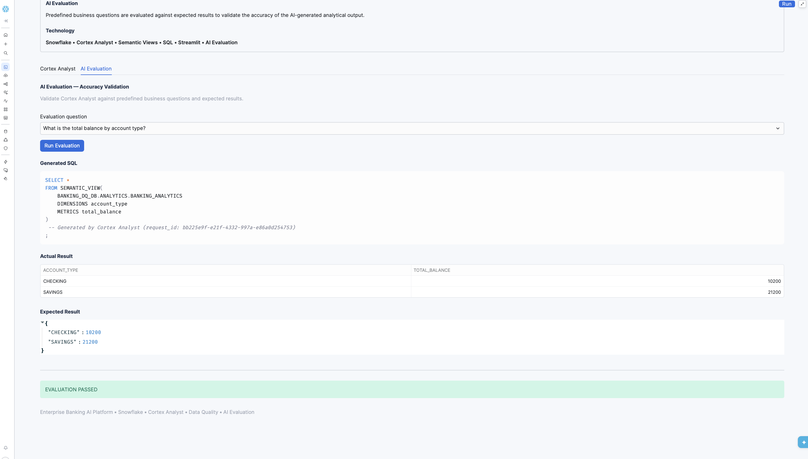

# Enterprise Banking AI Platform

An enterprise-style banking AI platform built on **Snowflake** that combines a semantic analytics layer, natural-language analytics, data-quality monitoring, and AI evaluation in a single Streamlit application.

The project demonstrates an end-to-end approach for building AI-enabled analytics on structured banking data while keeping the analytical workflow transparent and testable.

## What This Project Demonstrates

- **Snowflake Semantic View** for business-friendly data modeling
- **Cortex Analyst** for natural-language-to-SQL analytics
- **Data Quality Monitoring** for completeness, uniqueness, and business rules
- **AI Evaluation** using predefined questions and expected results
- **Streamlit** application for an interactive user experience
- **Git/GitHub integration** for version-controlled development

## Architecture

```text
                    ┌─────────────────────────────┐
                    │     Streamlit Application   │
                    │                             │
                    │  • Cortex Analyst           │
                    │  • Data Quality Monitoring   │
                    │  • AI Evaluation            │
                    └──────────────┬──────────────┘
                                   │
                                   ▼
                    ┌─────────────────────────────┐
                    │    Snowflake Semantic View  │
                    │                             │
                    │     BANKING_ANALYTICS       │
                    └──────────────┬──────────────┘
                                   │
                 ┌─────────────────┴─────────────────┐
                 │                                   │
                 ▼                                   ▼
      ┌─────────────────────┐             ┌─────────────────────┐
      │   Cortex Analyst    │             │   Data Quality      │
      │                     │             │       Rules         │
      │ Natural Language    │             │                     │
      │       ↓             │             │ Completeness        │
      │ Generated SQL       │             │ Uniqueness          │
      │       ↓             │             │ Business Validity   │
      │ Query Results       │             └──────────┬──────────┘
      └─────────────────────┘                        │
                                                     ▼
                                      ┌─────────────────────────┐
                                      │      Banking RAW        │
                                      │                         │
                                      │ Customers               │
                                      │ Accounts                │
                                      │ Transactions            │
                                      │ Loan Applications       │
                                      │ Branches                │
                                      └─────────────────────────┘
```

## Key Capabilities

### 1. Semantic Analytics

A Snowflake Semantic View defines the business meaning of the banking data through:

- Tables
- Relationships
- Dimensions
- Facts
- Metrics
- Business descriptions
- Verified business queries

This provides structured business context for natural-language analytics.

### 2. Cortex Analyst

Users can ask questions such as:

> What is the total balance by account type?

Cortex Analyst interprets the question, generates SQL using the semantic model, executes the query, and returns the analytical result.

The application displays both the generated SQL and the result so that the AI-generated analysis is transparent.

### 3. Data Quality Monitoring

The application monitors important banking data-quality conditions including:

- Required customer IDs
- Non-negative account balances
- Unique transaction IDs
- Required transaction amounts
- Unique loan application IDs
- Required loan amounts

The dashboard shows the number of failed records and whether each rule passes or fails.

### 4. AI Evaluation

The application includes predefined business questions with expected results.

The evaluation process compares:

```text
Business Question
       ↓
Cortex Analyst
       ↓
Generated SQL
       ↓
Actual Result
       ↓
Expected Result
       ↓
Evaluation Status
```

This provides a lightweight regression-style evaluation approach for natural-language analytics.

## Banking Data Model

The platform uses five banking tables:

| Table | Purpose |
|---|---|
| `CUSTOMERS` | Customer information |
| `ACCOUNTS` | Bank account information |
| `TRANSACTIONS` | Account transaction information |
| `LOAN_APPLICATIONS` | Loan application information |
| `BRANCHES` | Bank branch information |

The main relationships are:

```text
CUSTOMERS
    │
    ├── ACCOUNTS
    │      │
    │      └── TRANSACTIONS
    │
    └── LOAN_APPLICATIONS

BRANCHES
    │
    └── ACCOUNTS
```

## Technology Stack

| Area | Technology |
|---|---|
| Data Platform | Snowflake |
| Semantic Layer | Snowflake Semantic Views |
| Natural Language Analytics | Cortex Analyst |
| Application | Streamlit |
| Programming | Python, SQL |
| Snowflake Access | Snowpark |
| Version Control | Git / GitHub |
| Development Environment | Snowflake Workspaces |

## Project Structure

```text
snowflake-ai-engineering-platform/
│
├── cortex_project/
│   ├── BANKING_ANALYTICS.sv.yaml
│   ├── cortex-project.yaml
│   ├── 01_semantic_layer.sql
│   ├── 02_verified_queries.sql
│   ├── 03_dq_profiling.sql
│   ├── 04_dq_rules.sql
│   ├── 05_inject_dq_issues.sql
│   ├── 06_verify_dq_issues.sql
│   │
│   └── streamlit/
│       ├── streamlit_app.py
│       ├── pyproject.toml
│       ├── snowflake.yml
│       └── .streamlit/
│
├── screenshots/
│   ├── platform_overview.png
│   ├── cortex_analyst.png
│   ├── data_quality.png
│   └── ai_evaluation.png
│
├── docs/
│   ├── architecture.md
│   └── data_quality_and_evaluation.md
│
└── README.md
```

## Demo Screenshots

### Platform Overview



### Cortex Analyst



### Data Quality Monitoring



### AI Evaluation



## Documentation

For a deeper technical explanation:

- [Architecture and Implementation](docs/architecture.md)
- [Data Quality and AI Evaluation](docs/data_quality_and_evaluation.md)

## Engineering Focus

This project focuses on practical enterprise AI engineering principles:

- **Semantic modeling before AI analytics**
- **Transparent AI-generated SQL**
- **Data-quality validation**
- **Expected-result-based evaluation**
- **Version-controlled SQL and application code**
- **Separation of data, AI, evaluation, and presentation layers**

## Future Enhancements

Potential next steps include:

- Automated data-quality orchestration
- Historical DQ trend monitoring
- Additional Cortex Analyst verified queries
- Broader AI evaluation metrics
- Automated regression testing
- AI incident investigation
- Automated remediation recommendations
- Production monitoring and alerting
- CI/CD automation

## Disclaimer

This project uses synthetic banking data for demonstration and portfolio purposes.

No real customer or financial information is used.