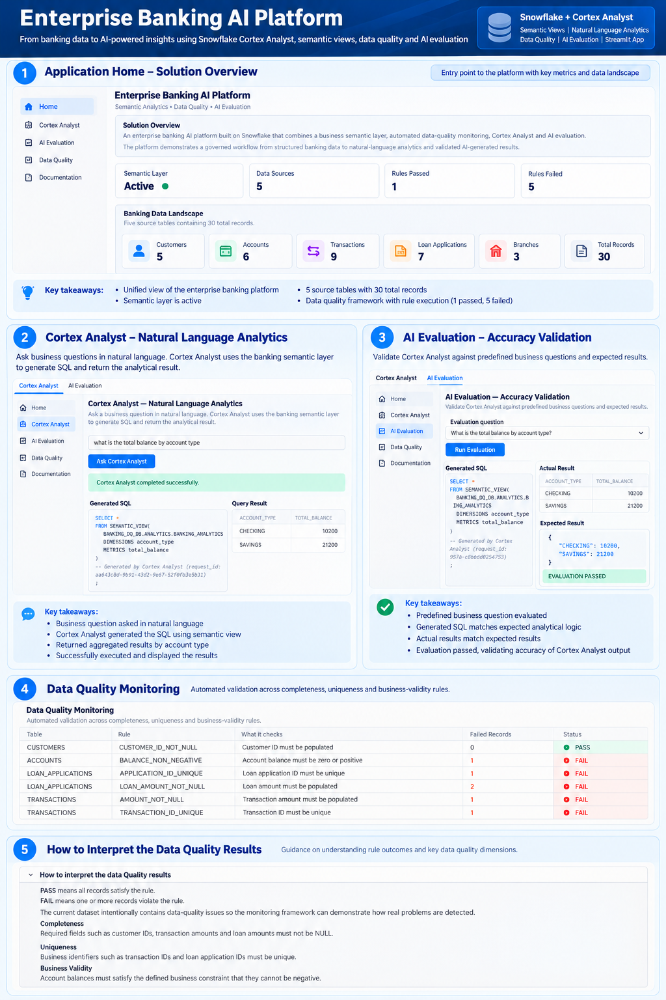
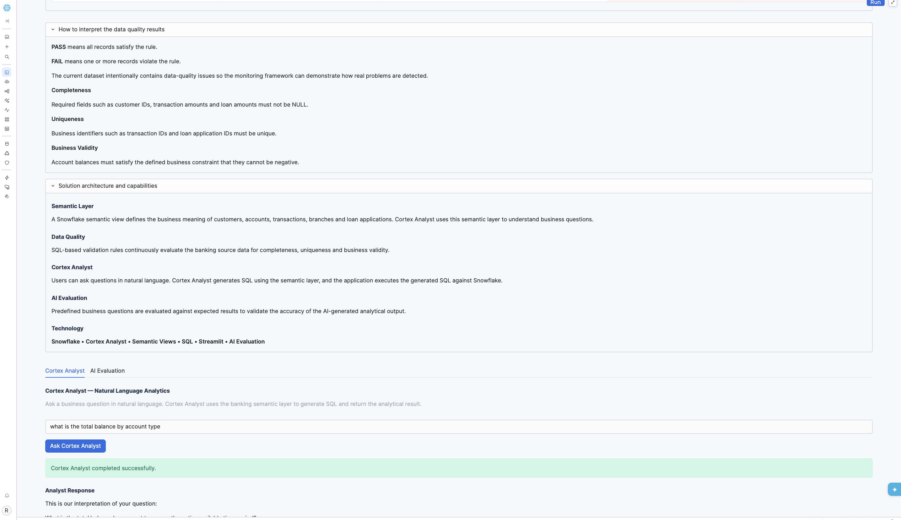
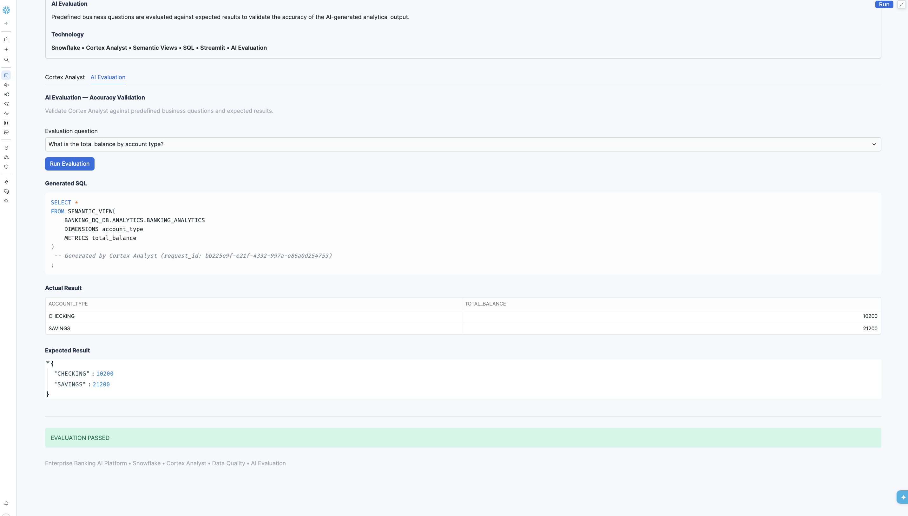
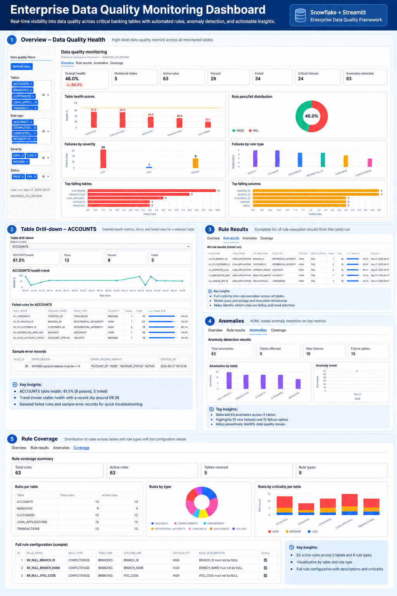
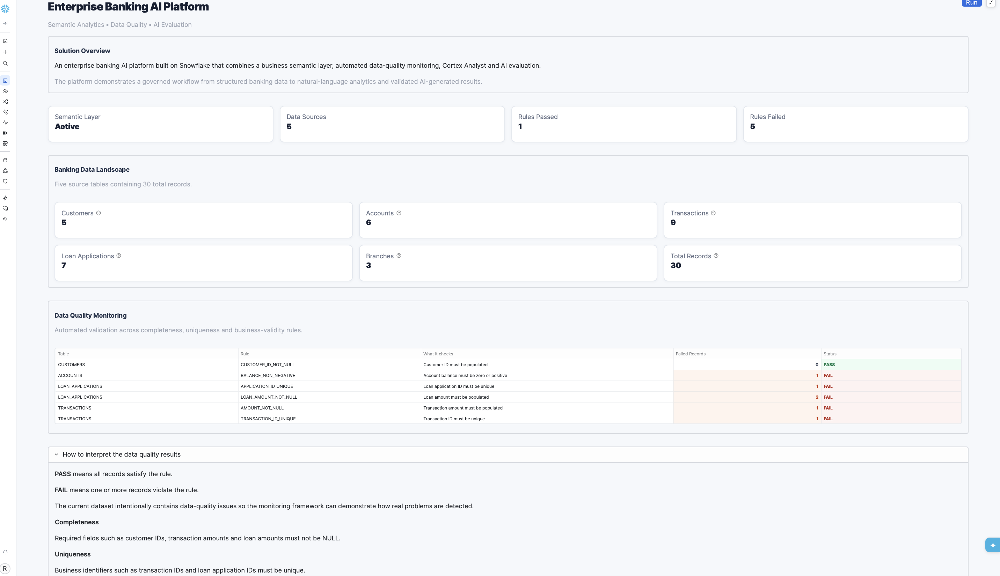

# Enterprise Banking AI Platform

## What This Project Is About

Modern enterprises increasingly use AI to turn business questions into analytical insights. However, putting an AI assistant on top of enterprise data is not enough. The underlying data must be **trusted**, the AI must be **grounded in business definitions**, its generated queries should be **transparent and testable**, and access to sensitive data must be **governed**.

This project demonstrates an end-to-end **Snowflake-based AI engineering platform** that brings these concerns together using a synthetic banking dataset.

The platform combines:

```text
Business Data
      ↓
Semantic Layer
      ↓
Natural-Language Analytics
      ↓
Data Quality
      ↓
AI Evaluation
      ↓
Governance
      ↓
Monitoring & Validation
```

It includes a user-facing **Streamlit application** powered by Snowflake and Cortex Analyst, as well as a separate **Cortex Code (CoCo) engineering workflow** for profiling, DQ rule development, execution, anomaly detection, and validation.

## Why This Matters

The important part of enterprise AI is not simply **“Can an LLM generate an answer?”**

It is:

> **Can the organization trust the answer, understand how it was produced, verify it against expectations, ensure the underlying data is reliable, and control who can access the data?**

This project demonstrates those engineering layers together:

- **Semantic grounding** — business questions are mapped through a governed semantic model rather than relying only on raw tables.
- **Transparency** — generated SQL is exposed so analytical behavior can be inspected.
- **Data quality** — DQ rules identify completeness, uniqueness, validity, and integrity issues.
- **AI evaluation** — analytical responses are compared against predefined expected results.
- **Governance** — RBAC, masking, and row-access policies demonstrate controlled data access.
- **AI-assisted engineering** — Cortex Code / CoCo is used to accelerate DQ engineering while keeping execution and validation human-directed.
- **Evidence-driven validation** — implementation artifacts, execution results, and screenshots provide traceability.

### The Core Idea

```text
             TRUSTWORTHY ENTERPRISE AI
                       │
        ┌──────────────┼──────────────┐
        │              │              │
     Grounding      Quality       Governance
        │              │              │
   Semantic View    DQ Rules      RBAC/Masking
        │              │              │
        └──────────────┼──────────────┘
                       │
                 AI Evaluation
                       │
                       ▼
             Transparent AI Analytics
```

**This is what makes the project more than a simple Cortex Analyst demo:** it demonstrates the engineering controls surrounding enterprise AI — **grounding, quality, evaluation, governance, validation, and observability-oriented thinking**.

> **Implementation boundary:** This is an enterprise-style AI engineering/portfolio implementation. Implemented capabilities are distinguished from production extensions later in this README; it is not presented as a fully production-deployed platform.


An enterprise-style banking AI engineering platform built on **Snowflake**, combining:

- **Semantic analytics** with Snowflake Semantic Views
- **Natural-language analytics** with Cortex Analyst
- **Data Quality (DQ) engineering and monitoring**
- **AI evaluation** for analytical questions
- **Snowflake governance** with RBAC, masking, and row-access policies
- **Cortex Code (CoCo)** assisted DQ engineering
- **Git/GitHub-based source control and implementation traceability**

The project uses synthetic banking data and is designed as an engineering/portfolio implementation. It focuses on making AI-assisted analytics **grounded, transparent, testable, and governed**.

---

## Architecture

```text
                         ENTERPRISE BANKING AI PLATFORM
                                      │
                 ┌────────────────────┴────────────────────┐
                 │                                         │
          APPLICATION EXPERIENCE                  AI ENGINEERING EXPERIENCE
                 │                                         │
             Streamlit                              Cortex Code / CoCo
                 │                                         │
      ┌──────────┼──────────┐                    Profile → Rules → Execute
      │          │          │                              │
      ▼          ▼          ▼                         Validate → Detect
   Cortex       DQ         AI Eval                         │
   Analyst   Monitoring                                  ▼
      │          │          │                       DQ Dashboard
      └──────────┴──────────┘                              │
                 │                                         │
                 └──────────────────┬──────────────────────┘
                                    ▼
                         ┌───────────────────────┐
                         │       Snowflake       │
                         │                       │
                         │ Semantic View         │
                         │ Banking RAW Data      │
                         │ DQ Metadata/Results   │
                         │ Governance Policies   │
                         └───────────────────────┘
```

The repository intentionally contains **two complementary implementation experiences**:

| Experience | Purpose | Primary Evidence |
|---|---|---|
| **Streamlit Application** | User-facing analytics, DQ monitoring, and AI evaluation | `screenshots/` |
| **Cortex Code / CoCo** | Profiling, DQ rule engineering, execution, anomaly detection, and validation | `coco_data_quality/` |
| **Shared Snowflake Foundation** | Banking data, semantic model, DQ objects, and governance | SQL/YAML + Snowflake objects |

---

# 1. Semantic Analytics

The semantic layer is implemented as:

```text
BANKING_DQ_DB.ANALYTICS.BANKING_ANALYTICS
```

It models five banking tables:

- `CUSTOMERS`
- `ACCOUNTS`
- `TRANSACTIONS`
- `LOAN_APPLICATIONS`
- `BRANCHES`

The Semantic View defines:

- **Dimensions**
- **Facts**
- **Metrics**
- **Relationships**
- Business descriptions
- AI SQL-generation guidance
- Verified-query capability

The semantic model provides a business-oriented abstraction over the physical banking tables so that analytical questions can be expressed using business concepts rather than raw table structures.

### Example metrics

- Total balance
- Average balance
- Account count
- Total transaction amount
- Transaction count
- Total loan amount
- Loan application count

### Source artifacts

```text
01_semantic_layer.sql
cortex_project/BANKING_ANALYTICS.sv.yaml
cortex_project/cortex-project.yaml
02_verified_queries.sql
```

---

# 2. Natural-Language Analytics with Cortex Analyst

Users can ask questions such as:

> **What is the total balance by account type?**

The Streamlit application sends the question to Cortex Analyst using the Snowflake semantic view.

```text
Business Question
       ↓
Cortex Analyst
       ↓
Semantic View
       ↓
Generated SQL
       ↓
Snowflake
       ↓
Query Result
```

The application exposes both the **generated SQL** and the **query result**, providing transparency into the analytical workflow.

### Example observed output

For the total-balance-by-account-type scenario, the implemented example returns:

| ACCOUNT_TYPE | TOTAL_BALANCE |
|---|---:|
| CHECKING | 10200 |
| SAVINGS | 21200 |



---

# 3. Data Quality Engineering

The repository contains a SQL-based DQ layer for the primary banking application and a separate, more extensive **Cortex Code / CoCo DQ framework**.

## Application DQ layer

The root SQL implementation defines **10 DQ rules** covering conditions such as:

- Identifier completeness
- Identifier uniqueness
- Non-negative account balances
- Transaction integrity
- Required transaction amounts
- Loan-application integrity
- Required loan amounts

The Streamlit application surfaces **six primary checks**:

1. Customer ID not null
2. Account balance non-negative
3. Transaction ID unique
4. Transaction amount not null
5. Loan application ID unique
6. Loan amount not null

The distinction is intentional: the SQL rule layer is broader than the checks currently displayed in the application UI.

### Controlled DQ testing

The repository also includes controlled issue injection:

```text
Profile
   ↓
Define Rules
   ↓
Inject Synthetic Defects
   ↓
Verify Detection
   ↓
Observe PASS / FAIL
```

Examples include:

- Negative account balance
- Duplicate transaction ID
- NULL transaction amount
- NULL loan amount

These are **synthetic test conditions**, not production banking data.



Source artifacts:

```text
03_dq_profiling.sql
04_dq_rules.sql
05_inject_dq_issues.sql
06_verify_dq_issues.sql
```

---

# 4. AI Evaluation

The platform includes a lightweight evaluation workflow for analytical questions.

```text
Evaluation Question
       ↓
Cortex Analyst
       ↓
Generated SQL
       ↓
Actual Result
       ↓
Normalize
       ↓
Expected Result
       ↓
PASS / FAIL
```

Current evaluation scenarios include:

- Total balance by account type
- Average balance by account type
- Loan applications by status

The evaluation is designed as a **lightweight regression-oriented check** rather than a complete production LLM evaluation framework.

For example, the implemented total-balance scenario compares:

```text
Expected:
CHECKING = 10200
SAVINGS  = 21200
```

against the analytical result returned by Cortex Analyst.



> **Implementation note:** The repository currently contains an expected-value discrepancy for the average-balance scenario between older documentation and the current Streamlit evaluation code. This should be reconciled against the actual source data before treating that scenario as a final published benchmark.

Source artifacts:

```text
streamlit/streamlit_app.py
docs/ai_evaluation.md
docs/data_quality_and_evaluation.md
```

---

# 5. Governance

Snowflake governance controls are implemented under:

```text
BANKING_DQ_DB.GOVERNANCE
```

Implemented artifacts include:

- `BANKING_DATA_STEWARD`
- `BANKING_ANALYST`
- `CUSTOMER_LAST_NAME_MASK`
- `CUSTOMER_ROW_ACCESS`
- Privilege grants
- Governance validation tests

### Masking

The customer last name masking policy allows authorized roles to see the actual value while other access paths receive:

```text
***MASKED***
```

### Row access

A row access policy is also implemented.

The current implementation should be understood as a **governance framework** rather than active regional/state-level filtering. The current analyst policy permits access to the defined customer rows; future business-unit or regional restrictions could be added to the policy logic.

### Governance validation

```text
07_governance.sql
        ↓
08_governance_tests.sql
        ↓
Role-dependent validation
```

---

# 6. Cortex Code / CoCo Data Quality Engineering

The repository contains a separate implementation under:

```text
coco_data_quality/
```

This is intentionally separate from the broader Streamlit application screenshots.

The CoCo workflow demonstrates AI-assisted Snowflake engineering across:

- Data profiling
- DQ rule design
- Metadata-driven rule configuration
- Dynamic rule execution
- Controlled defect injection
- Failed-record sampling
- Anomaly detection
- Troubleshooting
- Validation
- DQ monitoring

The engineering chain is:

```text
CoCo Instruction
       ↓
Generated SQL
       ↓
Snowflake Objects
       ↓
Execution
       ↓
Validation
       ↓
Anomaly Detection
       ↓
Dashboard
```

The engineer remains responsible for reviewing generated artifacts, deciding what to execute, validating results, and interpreting failures.

## CoCo DQ Framework

The framework uses:

- **63 DQ rules**
- **7 quality dimensions**
- Metadata-driven configuration
- Persisted rule results
- Failed-record samples
- Anomaly results
- A JavaScript stored procedure for orchestration
- Streamlit monitoring

The documented validation includes a baseline run and a second run after controlled anomaly injection.

### Baseline validation

```text
63 rules processed
0 execution errors

39 passed
24 failed

Overall health: 61.9%
```

### Anomaly validation

After the second controlled test set:

```text
63 rules processed
0 execution errors

29 passed
34 failed

Overall health: 46.0%

63 anomalies detected
```

The anomaly logic includes:

- Row-count change greater than 50%
- New failures where the previous run had zero failures
- Failure spikes above baseline average + 2 standard deviations

### CoCo DQ evidence



Detailed CoCo documentation:

```text
coco_data_quality/docs/README.md
coco_data_quality/docs/ARCHITECTURE.md
coco_data_quality/docs/TECHNICAL_OVERVIEW.md
coco_data_quality/docs/RULES_CATALOG.md
coco_data_quality/docs/DASHBOARD_GUIDE.md
```

---

# 7. Streamlit Application

The primary application is located at:

```text
streamlit/streamlit_app.py
```

The application uses a Snowflake active session and integrates with the Cortex Analyst API.

The user-facing experience includes:

- Platform overview
- Banking data landscape
- Cortex Analyst
- Generated SQL
- Query results
- Data quality monitoring
- AI evaluation
- Documentation/solution information

The screenshots below are the actual repository assets.

## Platform Overview



## Cortex Analyst


## Data Quality


## AI Evaluation


---

# 8. Banking Data Model

The shared application model contains five banking tables:

| Table | Purpose |
|---|---|
| `CUSTOMERS` | Customer information |
| `ACCOUNTS` | Bank account information |
| `TRANSACTIONS` | Account transaction information |
| `LOAN_APPLICATIONS` | Loan application information |
| `BRANCHES` | Bank branch information |

Relationships include:

```text
CUSTOMERS
    │
    ├── ACCOUNTS
    │      │
    │      └── TRANSACTIONS
    │
    └── LOAN_APPLICATIONS

BRANCHES
    │
    └── ACCOUNTS
```

The project uses synthetic banking data for demonstration and testing.

---

# 9. Technology Stack

### Snowflake

- Snowflake SQL
- Semantic Views
- Cortex Analyst
- Cortex Code / CoCo
- Snowpark
- Snowflake Streamlit
- RBAC
- Masking policies
- Row access policies

### Application

- Python
- Streamlit
- Pandas
- Snowpark
- REST API integration
- JSON request/response handling

### Engineering

- SQL
- YAML
- Git
- GitHub
- Metadata-driven DQ
- Validation scripts
- Synthetic test-data injection

---

# 10. Repository Structure

```text
snowflake-ai-engineering-platform/
│
├── 01_semantic_layer.sql
├── 02_verified_queries.sql
├── 03_dq_profiling.sql
├── 04_dq_rules.sql
├── 05_inject_dq_issues.sql
├── 06_verify_dq_issues.sql
├── 07_governance.sql
├── 08_governance_tests.sql
│
├── cortex_project/
│   ├── BANKING_ANALYTICS.sv.yaml
│   └── cortex-project.yaml
│
├── streamlit/
│   ├── streamlit_app.py
│   ├── pyproject.toml
│   └── snowflake.yml
│
├── screenshots/
│   ├── platform_overview.png
│   ├── Cortex_Analyst.png
│   ├── data_quality.png
│   └── ai_evaluation.png
│
├── coco_data_quality/
│   ├── 00_setup/
│   ├── 01_DQ_instructions/
│   ├── Generated_files/
│   ├── DQ_MONITORING_DASHBOARD/
│   ├── screenshots/
│   │   └── Coco_Data_Quality.png
│   └── docs/
│
└── docs/
    ├── architecture.md
    ├── ai_evaluation.md
    └── data_quality_and_evaluation.md
```

---

# 11. Engineering Traceability

A key design principle is that important outputs should be traceable to implementation artifacts.

```text
Source Artifact
      ↓
Snowflake Object
      ↓
Execution
      ↓
Validation
      ↓
Observed Output
      ↓
Screenshot / Evidence
```

Examples:

| Capability | Implementation | Evidence |
|---|---|---|
| Semantic layer | `01_semantic_layer.sql` + YAML | Semantic View |
| Verified query | Semantic configuration | Known analytical question |
| DQ profiling | `03_dq_profiling.sql` | Profiling output |
| DQ rules | `04_dq_rules.sql` | PASS/FAIL |
| Controlled defects | `05_inject_dq_issues.sql` | Known synthetic failures |
| DQ verification | `06_verify_dq_issues.sql` | Defect detection |
| Governance | `07_governance.sql` | Policies/roles |
| Governance testing | `08_governance_tests.sql` | Role-dependent validation |
| Cortex Analyst | `streamlit/streamlit_app.py` + Semantic View | Generated SQL/result |
| AI evaluation | Streamlit evaluation logic | Expected vs. actual |
| CoCo DQ | `coco_data_quality/` | Framework/dashboard evidence |

---

# 12. Documentation

Detailed engineering documentation:

1. **[Project Overview & Engineering Journey](docs/PROJECT_OVERVIEW.md)**
2. **[Technical Architecture & Implementation](docs/TECHNICAL_ARCHITECTURE.md)**
3. **[CoCo Data Quality Engineering](coco_data_quality/docs/TECHNICAL_OVERVIEW.md)**
4. **[AI Evaluation](docs/ai_evaluation.md)**
5. **[Data Quality & Evaluation](docs/data_quality_and_evaluation.md)**
6. **[CoCo Architecture](coco_data_quality/docs/ARCHITECTURE.md)**
7. **[CoCo Rules Catalog](coco_data_quality/docs/RULES_CATALOG.md)**
8. **[CoCo Dashboard Guide](coco_data_quality/docs/DASHBOARD_GUIDE.md)**

> The repository's current detailed documentation should be treated as the source of truth for implementation-specific behavior. The links above intentionally reference files that exist in the uploaded repository.

---

# 13. Implemented vs. Production Extensions

## Implemented / Demonstrated

- Snowflake banking data model
- Semantic View
- Semantic YAML / Cortex project artifacts
- Cortex Analyst integration
- Generated SQL visibility
- Verified-query capability
- SQL-based DQ rules
- Controlled DQ defect injection
- DQ verification
- Streamlit application
- Lightweight AI evaluation
- Snowflake RBAC
- Masking policy
- Row access policy
- Governance tests
- Cortex Code / CoCo DQ engineering workflow
- Metadata-driven DQ execution
- DQ anomaly detection
- Git/GitHub source control
- Implementation evidence

## Production Extensions

Potential next steps include:

- Scheduled DQ execution
- Alerting
- Historical DQ trend storage
- CI/CD deployment automation
- Expanded AI regression testing
- Latency and cost monitoring
- AI observability
- Prompt/model governance
- Audit logging
- Automated remediation
- Incident-management integration
- DEV → TEST → PROD promotion

These items are intentionally labeled as **production extensions** unless corresponding implementation and evidence are present in the repository.

---

# 14. Engineering Decisions

### Semantic abstraction

Business-facing analytical questions are grounded through a semantic model rather than exposing only physical table structures.

### Transparency

Generated SQL is surfaced to the user so the analytical path can be inspected.

### Controlled testing

Synthetic defects are intentionally introduced to validate DQ behavior.

### Separation of concerns

```text
Data
 ↓
Semantic Layer
 ↓
AI Analytics
 ↓
Data Quality
 ↓
Evaluation
 ↓
Governance
 ↓
Application
```

### Human-directed AI engineering

CoCo is used as an engineering accelerator. The engineer remains responsible for reviewing generated artifacts, execution decisions, validation, and interpretation.

### Evidence-driven development

Screenshots are treated as implementation evidence and are connected to source artifacts and observed outputs.

---

# 15. Project Positioning

This project demonstrates how Snowflake can be used as an integrated environment for:

```text
Business Semantics
        +
Natural-Language Analytics
        +
Data Quality
        +
AI Evaluation
        +
Governance
        +
AI-Assisted Engineering
```

The central engineering principle is:

> **AI-generated analytics should be grounded in business semantics, made transparent through generated SQL, validated against known expectations, and supported by data-quality and governance controls.**
